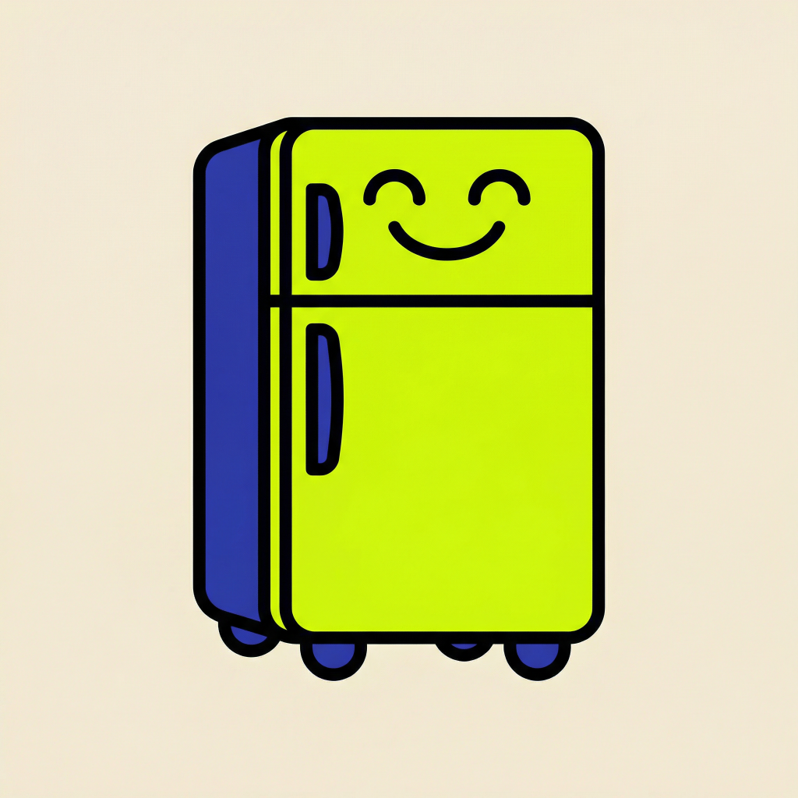

# FridgeChef 冰箱大厨

<p align="center">
  
</p>

<p align="center">
  <strong>Your AI Cooking Assistant</strong>
</p>

<p align="center">
  <a href="#features">Features</a> •
  <a href="#requirements">Requirements</a> •
  <a href="#installation">Installation</a> •
  <a href="#usage">Usage</a> •
  <a href="#contributing">Contributing</a> •
  <a href="#license">License</a>
</p>

---

## Overview

FridgeChef (冰箱大厨) is an AI-powered recipe generator iOS app that helps you create delicious recipes based on the ingredients you have in your fridge. Simply input your available ingredients, and the AI will generate a complete recipe with step-by-step instructions.

## Features

- 🤖 **AI Recipe Generation**: Generate recipes based on available ingredients using AI
- 🌐 **Multi-language Support**: Supports English and Simplified Chinese
- 🎨 **Beautiful NeoPop UI**: Modern, colorful interface with NeoPop design style
- 🌙 **Dark Mode Support**: Fully supports both light and dark modes
- 📱 **Recipe History**: Save and view your generated recipes
- ⚙️ **Customizable Settings**: Configure API endpoint and model

## Screenshots

<p align="center">
  <em>Screenshots will be added soon</em>
</p>

## Requirements

- iOS 17.0+
- Xcode 15.0+
- Swift 5.9+
- An API key for the AI service (ModelScope/MiniMax recommended)

## Installation

### Prerequisites

1. Clone the repository:
```bash
git clone https://github.com/yourusername/FridgeChef.git
cd FridgeChef
```

2. Open the project in Xcode:
```bash
open FridgeChef.xcodeproj
```

3. Build and run the app on your iOS device or simulator.

### Configuration

1. Launch the app
2. Go to Settings
3. Configure your API settings:
   - **Base URL**: `https://api-inference.modelscope.cn/v1` (default)
   - **Model**: `MiniMax/MiniMax-M2.5` (default)
   - **API Key**: Your API key from ModelScope

## Usage

1. **Home Screen**: View your recipe history and statistics
2. **Add Ingredients**: Tap "Start Cooking" and enter your available ingredients
3. **Quick Select**: Use quick select buttons for common ingredients
4. **Generate Recipe**: Tap "Generate Recipe" to get AI-generated recipes
5. **Save Recipe**: Save your favorite recipes for later

## Architecture

The app is built using:

- **SwiftUI**: Modern declarative UI framework
- **Core Data**: Local data persistence
- **MVVM Architecture**: Clean separation of concerns
- **NeoPop Design**: Custom UI components with bold, colorful styling

### Project Structure

```
FridgeChef/
├── FridgeChef/
│   ├── FridgeChefApp.swift          # App entry point
│   ├── HomeView.swift               # Home screen with recipe history
│   ├── InputView.swift              # Ingredient input screen
│   ├── ResultView.swift             # Recipe result display
│   ├── SettingsView.swift           # App settings
│   ├── AllRecipesView.swift         # All recipes list
│   ├── RecipeDetailView.swift       # Recipe detail view
│   ├── NeoPopComponents.swift       # Reusable UI components
│   ├── APIService.swift             # API communication
│   ├── AppColors.swift              # Color definitions
│   ├── AppSettings.swift            # App settings management
│   ├── Persistence.swift            # Core Data stack
│   ├── String+Localization.swift    # Localization utilities
│   ├── en.lproj/                    # English localization
│   └── zh-Hans.lproj/               # Chinese localization
├── FridgeChefTests/                 # Unit tests
└── FridgeChefUITests/               # UI tests
```

## Contributing

We welcome contributions! Please see [CONTRIBUTING.md](CONTRIBUTING.md) for guidelines.

### Development Setup

1. Fork the repository
2. Create a feature branch: `git checkout -b feature/amazing-feature`
3. Commit your changes: `git commit -m 'Add amazing feature'`
4. Push to the branch: `git push origin feature/amazing-feature`
5. Open a Pull Request

## Localization

The app currently supports:
- 🇺🇸 English
- 🇨🇳 Simplified Chinese (简体中文)

To add a new language:
1. Create a new `.lproj` folder in `FridgeChef/`
2. Copy `Localizable.strings` from `en.lproj/`
3. Translate all strings
4. Update `AppSettings.swift` to add the new language option

## License

This project is licensed under the MIT License - see the [LICENSE](LICENSE) file for details.

## Acknowledgments

- Design inspired by NeoPop style
- Powered by ModelScope AI API
- Built with SwiftUI and Core Data

## Contact

For questions or suggestions, please open an issue on GitHub.

---

<p align="center">
  Made with ❤️ and 🍳
</p>
